#  Job Management Web Application

A full-stack **Job Management Web App** that  enables job seekers to browse and apply for positions, track application statuses, and manage resumes/cover letters, while allowing recruiters to post jobs, review applicants, and update application statuses — streamlining the recruitment process and improving user engagement. It uses a Django + DRF backend, PostgreSQL for data storage, and a modern React + TypeScript + Tailwind CSS frontend.

---
### Project Screenshots

<div style="display: flex; gap: 10px;">
  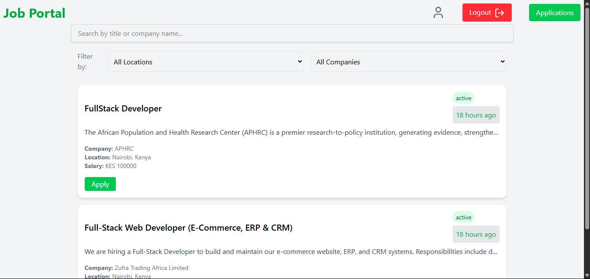
   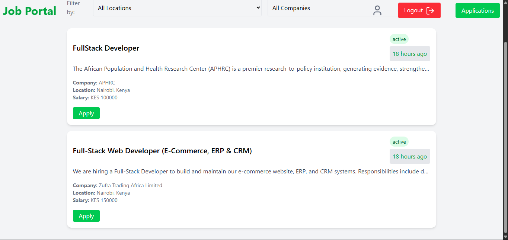
    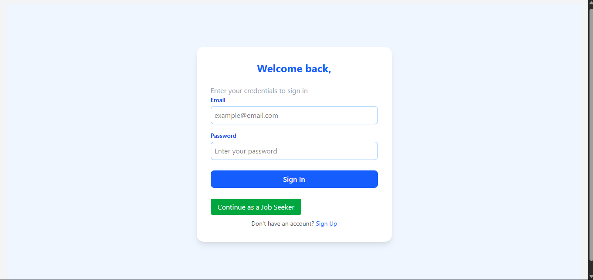
     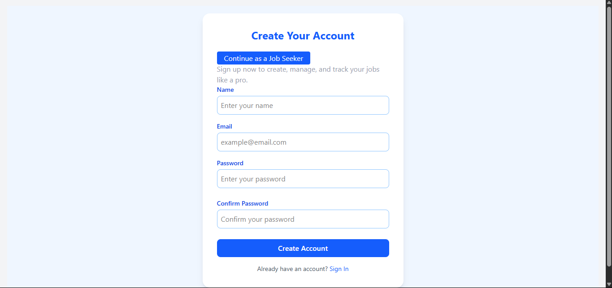
      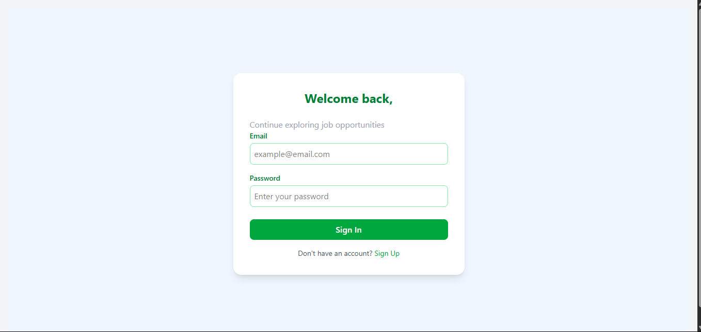
       
        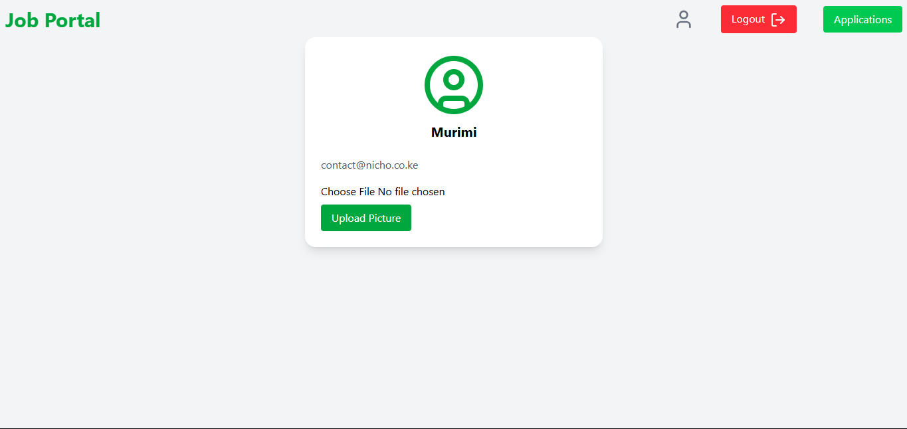
         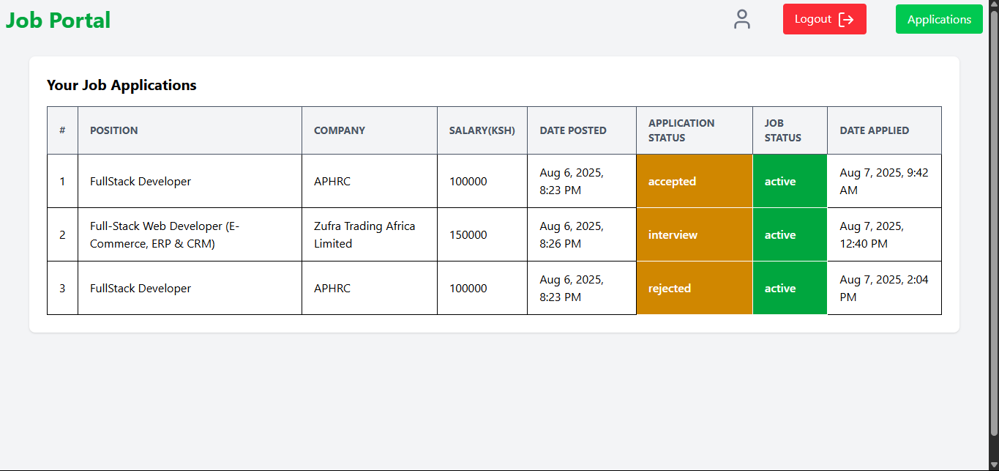
          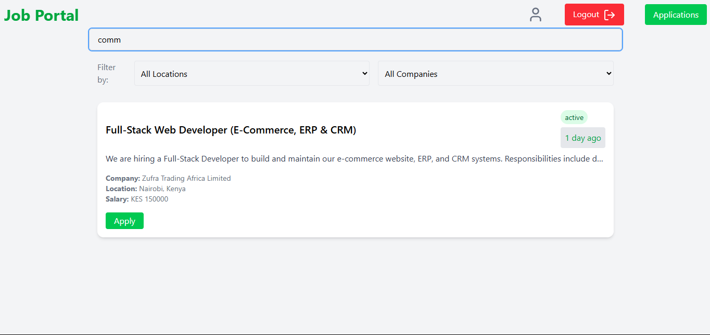
           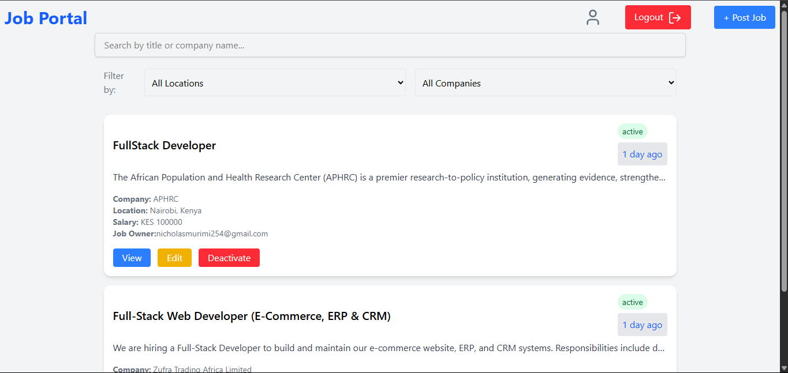
            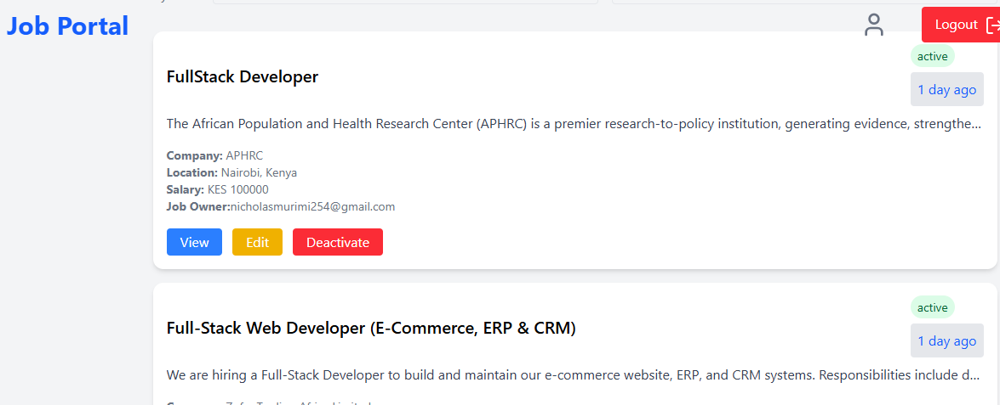
             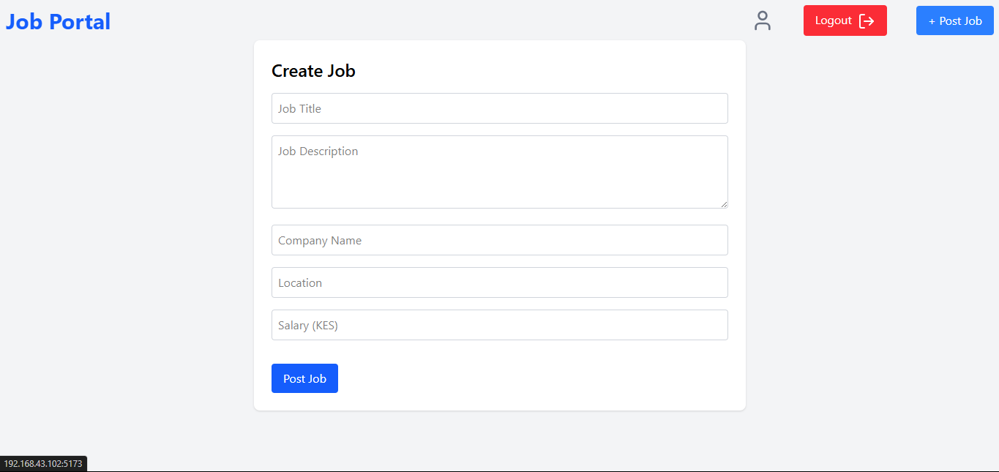
              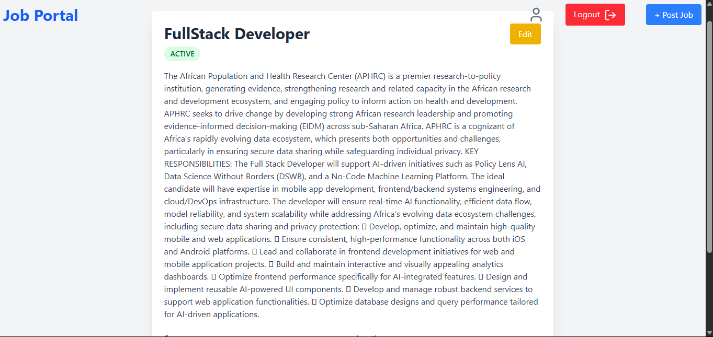
               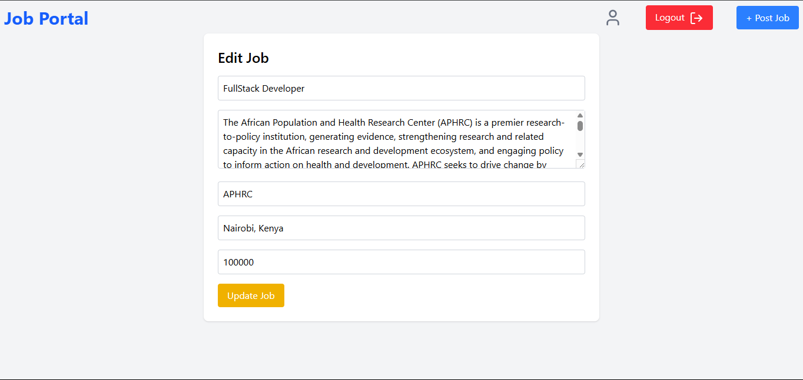
                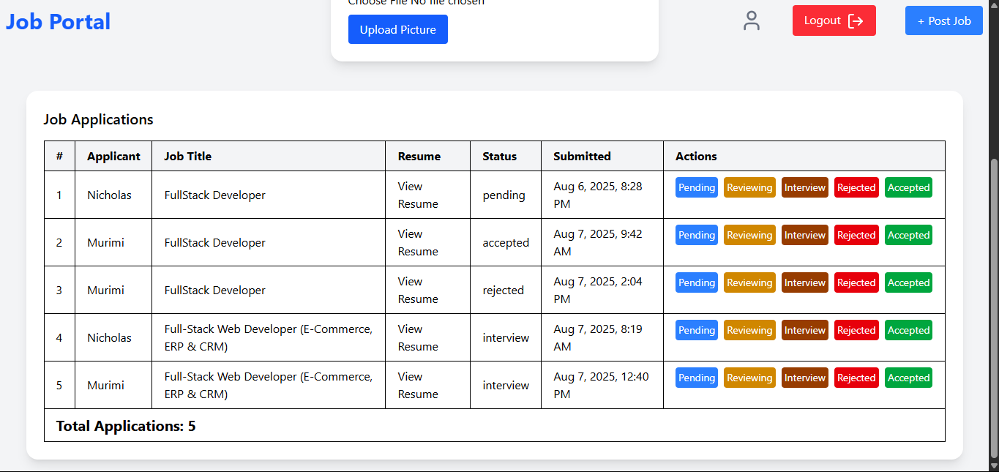
 
</div>


##  Tech Stack

**Backend**
- Django
- Django REST Framework
- PostgreSQL
- Docker

**Frontend**
- React
- TypeScript
- Tailwind CSS
- Axios (for REST API communication)

---

##  Features

-  Create, update, view job listings
-  Soft-delete jobs (mark as inactive)
-  Filter jobs by company and location
-  Job application
-  Applicant review
-  Application status update

<h3> Thought Process</h3>

<p>When building this Job Management Web App, I made a number of technical decisions to improve the developer experience, application stability, and performance.</p>

<h4> Why I Chose TypeScript on the Frontend</h4>

<p>I used TypeScript with React to bring strong typing and structure to the codebase. Since this is a full-stack project with multiple interconnected components (forms, job cards, filters, etc.), TypeScript helped me:</p>

<ul>
  <li>Catch bugs early during development through compile-time type checking.</li>
  <li>Clearly define the shape of data (e.g., <code>Job</code>, <code>Company</code>, etc.) which made it easier to work with API responses.</li>
  <li>Improve code readability and maintainability, especially when passing props between components.</li>
  <li>Benefit from smarter editor features like auto-completion, type hints, and refactoring support in VS Code.</li>
</ul>

<p>This decision makes the frontend more <strong>robust</strong>, <strong>self-documenting</strong>, and <strong>easier to scale</strong> as the project grows.</p>

<h4> Search Feature Optimization</h4>

<p>For the job search functionality, I optimized performance by <strong>filtering the already-fetched jobs on the client side</strong>, instead of making repeated API or database calls for every search query.</p>

<p>This approach has several benefits:</p>

<ul>
  <li><strong>Reduced database load:</strong> By avoiding multiple hits to the backend.</li>
  <li><strong>Faster UX:</strong> Users get instant search results without waiting for a network response.</li>
  <li><strong>Offline-resilience:</strong> Since the data is already in memory, it could work even with temporary connection loss.</li>
</ul>

<p>This client-side filtering strategy fits well for small to medium datasets and results in a <strong>snappier, more responsive UI</strong>.</p>


##  Backend Setup (Django + PostgreSQL)

###  1. Clone the repository

If you haven’t cloned the project yet, run:

```bash
git clone https://github.com/Nic3holas-wq/job-management-system.git
cd job-management-system
```
### 2. Navigate to `backend/` directory

```bash
cd backend

```
### 3. Create and activate a virtual environment
On macOS/Linux:
```bash
python -m venv venv
source venv/bin/activate
```
On Windows:
```bash
python -m venv venv
venv\Scripts\activate
```
### 4. Install Django and Django REST Framework

```bash
pip install django djangorestframework psycopg2-binary
```
### 5. Create the Django project

```bash
django-admin startproject jobportal .
```
### 6. Create the app

```bash
python manage.py startapp main
```
### 7. Register the app and REST framework in jobportal/settings.py
Add 'main' and 'rest_framework' to the INSTALLED_APPS list:
```bash
INSTALLED_APPS = [
    ...
    'rest_framework',
    'main',
]
```
### 8. Configure PostgreSQL database in jobportal/settings.py
Update the DATABASES section like so:
```bash
DATABASES = {
    'default': {
        'ENGINE': 'django.db.backends.postgresql',
        'NAME': 'your_db_name',
        'USER': 'your_db_user',
        'PASSWORD': 'your_db_password',
        'HOST': 'localhost',
        'PORT': '5432',
    }
}
```
Ensure PostgreSQL is installed, running, and the database exists.

### 9. Run initial migrations
```bash
python manage.py migrate
```

### 10. (Optional) Create a superuser
```bash
python manage.py createsuperuser
```
Follow the prompts to set up an admin account.

### 11. Run the development server
```bash
python manage.py runserver 0.0.0.0:8000
```
Your backend is now running and can be accessed from:
```bash
http://<your-local-ip>:8000/api/
```

##  Frontend Setup (React + TypeScript + Tailwind CSS)

Follow these steps to set up and run the frontend of the application.

###  1. Clone the repository

If you haven’t cloned the project yet, run:

```bash
git clone https://github.com/Nic3holas-wq/job-management-system.git
cd job-management-system
```

### 2. Install frontend dependencies
Make sure you're in the job-management-system folder:

```bash
npm install
```

### 3. Start the frontend development server
```bash
npm run dev
```
Once it starts, open your browser and go to:

```bash
http://localhost:5173
```

 #### Additional Configuration (if needed)
 If Tailwind CSS is not yet installed, install and configure it:

 ```bash
npm install -D tailwindcss postcss autoprefixer
npx tailwindcss init -p
```
Update tailwind.config.js:
```bash
export default {
  content: [
    "./index.html",
    "./src/**/*.{js,ts,jsx,tsx}",
  ],
  theme: {
    extend: {},
  },
  plugins: [],
};
```
Update src/index.css:
```bash
@tailwind base;
@tailwind components;
@tailwind utilities;
```
## License

This project is licensed under the MIT License.  
See the [LICENSE](./LICENSE) file for details.
